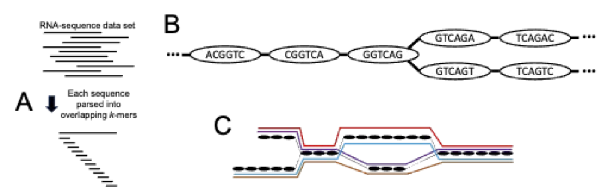
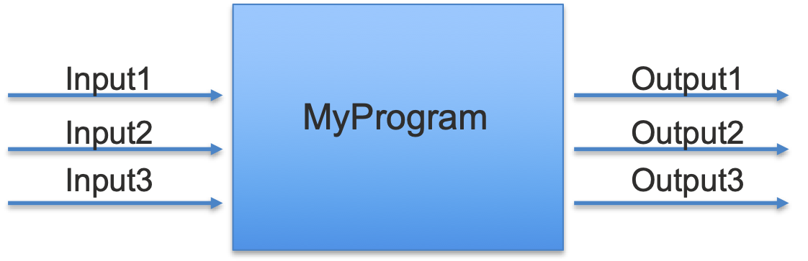
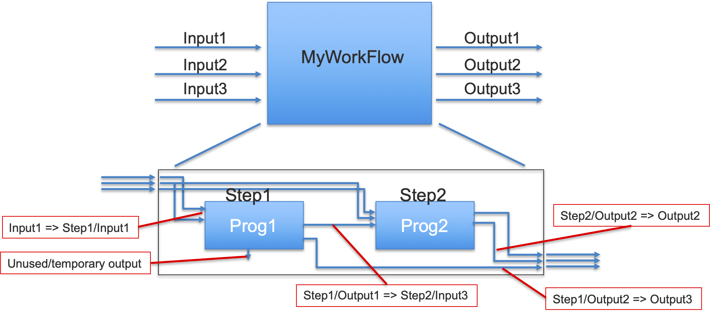

# Background Materials

## Why do we sequence RNA?
RNA-sequencing (RNA-seq) is the most common means by which biological samples are characterized at the molecular level.  In brief, it is a means of measuring which genes have RNA copies (transcripts) present in a sample and in what relative abundance.  The sample is prepared in such a way that DNA and proteins are degraded away, and then the remaining RNA is prepared such that it can be read (as a series of DNA bases A, C, G, and T) on a modern sequencer.  Sequencing machines are generally classified as short read, which produces sequence read lengths of 50 to 150 nucleotides, or long-read, which can generate up to tens of thousands of bases.  Short-read sequencers have been available for a longer time, and remain more capable of high throughput quantitative output, and these reads are the focus of our work here.

The standard workflow analysis of RNA-seq data consists of these broad steps:
- Quality assessment and preprocessing
- Assignment of reads to transcripts/genes
- Normalization of reads between samples
- Assessment of differential expression of transcripts/genes between experimental conditions
- Interpretation of the resulting differential expression profiles

Implicit in the workflow above is the existence of a target transcriptome to which the RNA-seq reads can be compared, aligned, assigned for quantification.  For well-studied organisms, such as human, mouse, zebrafish, or other model organisms, there are abundant reference materials available from such sites as [Ensembl](https://www.ensembl.org/), [NCBI](https://ncbi.nlm.nih.gov/), and the [UCSC Genome Browser](https://genome.ucsc.edu/).  

For less well studied organisms, no such references are generally available, however, the RNA-seq data contains the information necessary to infer not only abundance, but also the transcript sequences from which the data was generated.  The process of inferring the starting transcripts from the data, termed ***Transcriptome Assembly***, is the focus of this module.

## Transcriptome Sequence Assembly
As a first approximation, sequence assembly of a single molecule (*e.g.*, a chromosome) can be thought of as analogous to the process of reconstructing a picture from smaller, overlapping segments of the picture.  Overlapping pieces are identified and matched, extending the construct until an estimation of the complete picture is generated.  To make this metaphor a bit more realistic, the subsegments of the original picture are *imperfect*, such that successful construction of the complete picture will require error identification (or at least estimation) and correction.  

In order to extend this analog to transcriptome assembly, imagine that instead of one picture, our smaller segments instead are drawn from many pictures.  Now the process of reconstruction will necessarily include a step that attempts to separate the smaller segments into related groups, after which the assembly procedure proceeds.

#### Preprocessing and Data Cleaning
For reasons described below, stringent quality assessment and filtering of the data is generally carried out before the assembly process is begun.  The primary steps include:
- Removal of low quality score data
- Removal of contaminant sequence data
- Removal of known functional RNA

#### Sequence Assembly

<b>Figure 1</b> (to the right) Conceptual diagram of a sequence-defined de Bruijn graph. (A) Each sequence in an RNA-seq is broken into overlapping k-mers. (B) Each k-mer becomes a node in the graph, shown in example with k=6. Edges are drawn between nodes that match k-1 contiguous nucleotides.  (C) Putative transcripts (shown in distinct colors) are represented as traversals of one of the many connected components of the graph generated by the starting sequence set.

- Sequence Assembly is generally accomplished through the use of a [de Bruijn graph](https://en.wikipedia.org/wiki/De_Bruijn_graph), which is constructed from *k-mers*, the subsequences of length *k* found in the larger sequences.  In the most basic de Bruijn graph, each node is labeled with subsequence of length *k*, and edges are drawn between nodes whose sequences overlap by *k*-1 nucleotides. 
- Use of a de Bruijn graph is computationally efficient (especially compared to exhaustive pairwise alignment of all sequence reads), all "long-range" information is weakened, necessitating further QC and possible filtering on the 
- Published studies have demonstrated that the outcome 

#### Assembly Assessment
- Internal consistency (reads matching final transcripts)
- External consistency with known features. 
    - [BUSCO](https://busco.ezlab.org/) is an innovative analysis and set of tools developed by the [EZlab at the Swiss Insitute of Bioinformatics](https://www.ezlab.org/).  The fundamental idea behind BUSCO (**B**enchmarking **U**niversal **S**ingle-**C**opy **O**rthologs) derives from the Zdobnov group's analysis of the growing body of deeply sequenced genomes and transcriptomes across broad phylogenetic ranges.  What they found was that for any given definable phylogenetic range (*e.g.*, vertebrates, bacteria, or something as specific as mammals or insects), there is a core group of protein-coding genes that is both universal (or nearly so) in occurrence and also nearly always present only in a single-copy with no close paralogs or other homologs.  

#### Assembly Refinement
Assemblies are refined in several different manners
- Removal of redundant (or likely so) transcripts, based on sequence similarity between assembled forms
- Limit to transcripts with predicted/conceptual translated protein sequences that match known proteins in other organisms

For Assembly refinement, TransPi workflow relies primarily on the "Evidential Gene"

## Workflow Execution with Nextflow

It is standard practice in modern biotechnology, bioinformatics, and computational biology that most complex analysis are carried out not by a single comprehensive program, but are instead carried out in a defined sequence of multiple programs.  The process of running through these steps in the proper order is collectively called a ***workflow*** or ***pipeline***.  

Workflow management systems, *e.g.*, Nextflow, provide a syntax for defining the order of steps and the associate flow of information between steps, while also providing management/control software that can read and carry out these workflows.  The workflow control systems (which are generally platform specific) are responsible for allocating resources, activating analysis steps, and also making sure that all steps occur in the proper order (e.g., only activating a sequence alignment program only after the sequence quality control has been performed).

Workflows can be conceptually broken up into steps or modules (see the figure at left), which formalize the flow of information as inputs and outputs.  A workflow conceptually ties the steps/modules together and enforces the dependencies (see the figure at right), specifically in that if output from one step is input for a later step, the later step is blocked until the earlier step completes.

## Running Individual Analysis Steps with Docker
One of the most frustrating aspects of carrying out computational biology/bioinformatics programs is installing and maintaining the software programs that we use.  These programs are built by a wide variety of research and industrial organizations, and they are built on a wide variety of platforms and utilize an even wider set of supporting libraries and auxiliary components.

One of our primary tools in detailing 
#### What is a container?
#### Why do we use containers
#### How do we properly format a command for use with docker?

## Running workflows using the Google Cloud Lifesciences API (GLS)
#### What do we gain by using GLS
NOT READY YET- will come as an enhancement.

## References and Additional Links
