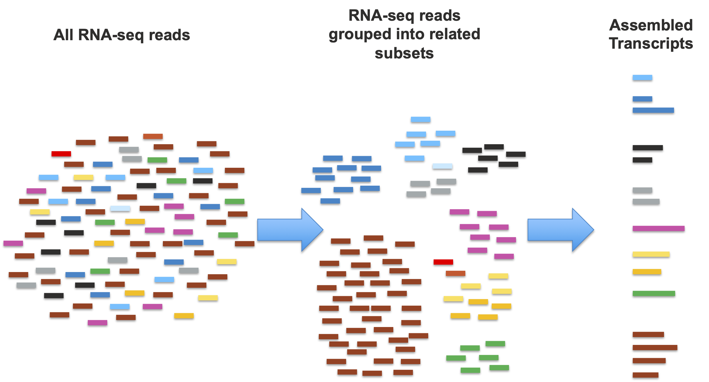
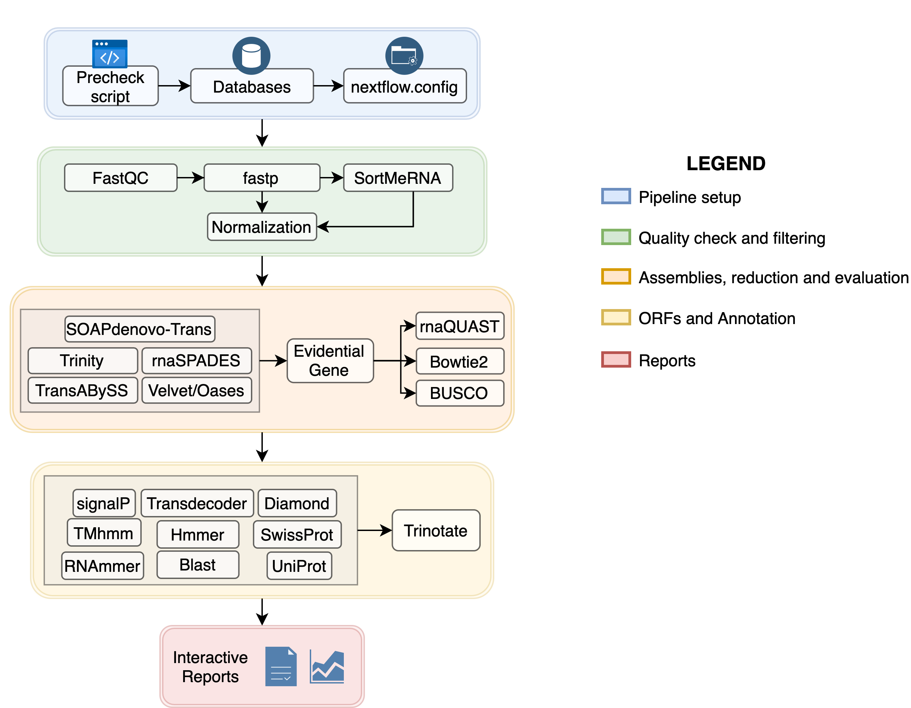

# MDI Biological Laboratory RNA-seq Transcriptome Assembly Module
---------------------------------

## Contents

+ [Overview](#overview)
+ [Learning goals](#learning-goals)
+ [Biological Problem](#biological-problem)
+ [Workflow Diagrams](#workflow-diagrams)
+ [Data](#data)
+ [Troubleshooting](#troubleshooting)
+ [Funding](#funding)
+ [License for Data](#license-for-data)

## Overview
This module teaches you how to perform a short-read RNA-seq Transcriptome Assembly with a Cloud Computing Platform using a Nextflow pipeline. In addition to the overview given in this README, you will find README related to each platform (AWS, Google Cloud) and Jupyter notebooks that teach you different components of RNA-seq in the cloud. 

## Learning goals:
1. From a *biological perspective*, demonstration of the **process of transcriptome assembly** from raw RNA-seq data.
2. From a *computational perspective*, demonstration of **computing using workflow management and container systems**.
3. Also from an *infrastructure perspective*, demonstration of **carrying out these analyses efficiently in a cloud environment.**

## **Biological Problem**
The combination of increased availability and reduced expense in obtaining high-throughput sequencing has made transcriptome profiling analysis (primarily with RNA-seq) a standard tool for the molecular characterization of widely disparate biological systems. Researchers working in common model organisms, such as mouse or zebrafish, have relatively easy access to the necessary resources (e.g., well-assembled genomes and large collections of predicted/verified transcripts), for the analysis and interpretation of their data. In contrast, researchers working on less commonly studied organisms and systems often must develop these resources for themselves.

Transcriptome assembly is the broad term used to describe the process of estimating many (or ideally all) of an organism’s transcriptome based on the large-scale but fragmentary data provided by high-throughput sequencing. A "typical" RNA-seq dataset will consist of tens of millions of reads or read-pairs, with each contiguous read representing up to 150 nucleotides in the sequence. Complete transcripts, in contrast, typically range from hundreds to tens of thousands of nucleotides in length. In short, and leaving out the technical details, the process of assembling a transcriptome from raw reads (Figure 2) is to first make a "best guess" segregation of the reads into subsets that are most likely derived from one (or a small set of related/similar genes), and then for each subset, build a most-likely set of transcripts and genes.

**Figure 2:** The process from raw reads to first transcriptome assembly.

Once a new transcriptome is generated, assessed, and refined, it must be annotated with putative functional assignments to be of use in subsequent functional studies.  Functional annotation is accomplished through a combination of assignment of homology-based and ab initio methods. The most well-established homology-based processes are the combination of protein-coding sequence prediction followed by protein sequence alignment to databases of known proteins, especially those from human or common model organisms. Ab initio methods use computational models of various features (e.g., known protein domains, signal peptides, or peptide modification sites) to characterize either the transcript or its predicted protein product. This training module will cover multiple approaches to the annotation of assembled transcriptomes.

## **Workflow Diagrams**

 
**Figure 3:** Nextflow workflow diagram. (Rivera 2021).  
Image Source: https://github.com/PalMuc/TransPi/blob/master/README.md

Explanation of which notebooks execute which processes:

+ Notebooks labeled 0 ([Submodule_00_Background.ipynb](./Submodule_00_Background.ipynb) and [00_Glossary.md](./00_Glossary.md)) respectively cover background materials and provide a centralized glossary for both the biological problem of transcriptome assembly, as well as an introduction to workflows and container-based computing.
+ Notebook 1 ([Submodule_01_prog_setup.ipynb](./Submodule_01_prog_setup.ipynb)) is used for setting up the environment. It should only need to be run once per machine. (Note that our version of TransPi does not run the `precheck script`. To avoid the headache and wasted time, we have developed a workaround to skip that step.)
+ Notebook 2 ([Submodule_02_basic_assembly.ipynb](./Submodule_02_basic_assembly.ipynb)) carries out a complete run of the Nextflow TransPi assembly workflow on a modest sequence set, producing a small transcriptome.
+ Notebook 3 ([Submodule_03_annotation_only.ipynb](./Submodule_03_annotation_only.ipynb)) carries out an annotation-only run using a prebuilt, but more complete transcriptome.
+ Notebook 4 ([Submodule_04_google_batch_assembly.ipynb](./Submodule_04_google_batch_assembly.ipynb)) carries out the workflow using the Google Batch API.
+ Notebook 5 ([Submodule_05_Bonus_Notebook.ipynb](./Submodule_05_Bonus_Notebook.ipynb)) is a more hands-off notebook to test basic skills taught in this module.

## **Data** 
The test dataset used in the majority of this module is a downsampled version of a dataset that can be obtained in its complete form from the SRA database (Bioproject [**PRJNA318296**](https://www.ncbi.nlm.nih.gov/bioproject/PRJNA318296), GEO Accession [**GSE80221**](https://www.ncbi.nlm.nih.gov/geo/query/acc.cgi?acc=GSE80221)). The data was originally generated by **Hartig et al., 2016**. We downsampled the data files in order to streamline the performance of the tutorials and stored them in a Google Cloud Storage bucket. The sub-sampled data, in individual sample files as well as a concatenated version of these files are available in our Google Cloud Storage bucket at `gs://nigms-sandbox/nosi-inbremaine-storage/resources/seq2`.

Additional datasets for demonstration of the annotation features of TransPi were obtained from the NCBI Transcriptome Shotgun Assembly archive. These files can be found in our Google Cloud Storage bucket at `gs://nigms-sandbox/nosi-inbremaine-storage/resources/trans`.
- Microcaecilia dermatophaga 
    - Bioproject: [**PRJNA387587**](https://www.ncbi.nlm.nih.gov/bioproject/PRJNA387587)
    - Originally generated by **Torres-Sánchez M et al., 2019**. 
- Oncorhynchus mykiss
    - Bioproject: [**PRJNA389609**](https://www.ncbi.nlm.nih.gov/bioproject/PRJNA389609)
    - Originally generated by **Wang J et al., 2016**, **Al-Tobasei R et al., 2016**, and **Salem M et al., 2015**. 
- Pseudacris regilla
    - Bioproject: [**PRJNA163143**](https://www.ncbi.nlm.nih.gov/bioproject/PRJNA163143)
    - Originally generated by **Laura Robertson, USGS**. 

The final submodule ([Submodule_05_Bonus_Notebook.ipynb](./Submodule_05_Bonus_Notebook.ipynb)) uses an additional dataset pulled from the SRA database. We are using the RNA-seq reads only and have subsampled and merged them to a collective 2 million reads. This is not a good idea for real analysis, but was done to reduce the costs and runtime. These files are avalible in our Google Cloud Storage bucket at `gs://nigms-sandbox/nosi-inbremaine-storage/resources/seq2`.
- Apis mellifera
    - Bioproject: [**PRJNA274674**](https://www.ncbi.nlm.nih.gov/bioproject/PRJNA274674)
    - Originally generated by **Galbraith DA et al., 2015**.

## **Troubleshooting**
- If a quiz is not rendering:
    - Make sure the `pip install` cell was executed in Submodule 00.
    - Try re-executing `from jupytercards import display_flashcards` or `from jupyterquiz import display_quiz` depending on the quiz type. 
- If a file/directory is not able to be found, make sure that you are in the right directory. If the notebook is idle for a long time, gets reloaded, or restarted, you will need to re-run Step 1 of the notebook. (`%cd /home/jupyter`)
- Sometimes, Nextflow will print `WARN:` followed by the warning. These are okay and should not produce any errors.
- Sometimes Nextflow will print `Waiting for file transfers to complete`. This may take a few minutes, but is nothing to worry about.
- If you are unable to create a bucket using the `gsutil mb` command, check your `nextflow-service-account` roles. Make sure that you have `Storage Admin` added.
- If you are trying to execute a terminal command in a Jupyter code cell and it is not working, make sure that you have an `!` before the command.
    - e.g., `mkdir example-1` -> `!mkdir example-1`

## **Funding** 

MDIBL Computational Biology Core efforts are supported by two Institutional Development Awards (IDeA) from the National Institute of General Medical Sciences of the National Institutes of Health under grant numbers P20GM103423 and P20GM104318.

## **License for Data** 

Text and materials are licensed under a Creative Commons CC-BY-NC-SA license. The license allows you to copy, remix and redistribute any of our publicly available materials, under the condition that you attribute the work (details in the license) and do not make profits from it. More information is available [here](https://tilburgsciencehub.com/about).

This work is licensed under a [Creative Commons Attribution-NonCommercial-ShareAlike 4.0 International License](http://creativecommons.org/licenses/by-nc-sa/4.0/)  

The TransPi Nextflow workflow was developed and released by Ramon Rivera and can be obtained from its [GitHub repository](https://github.com/PalMuc/TransPi)
