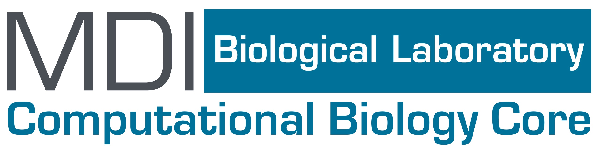
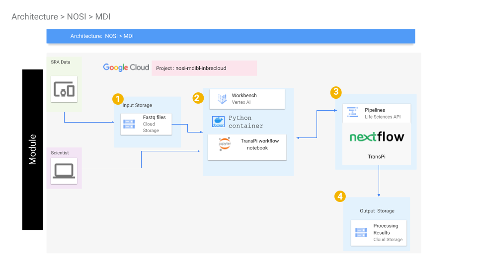
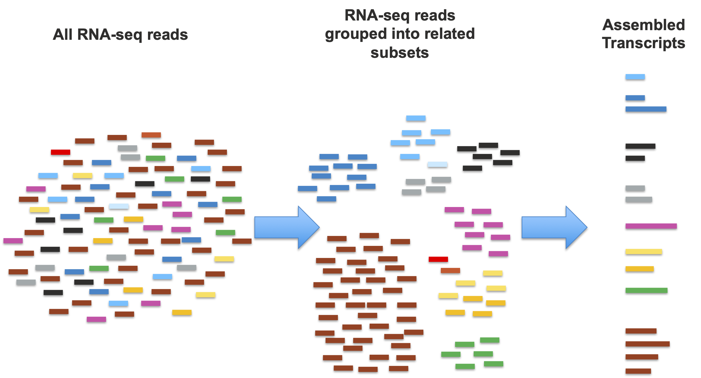
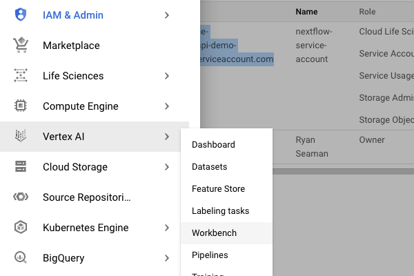
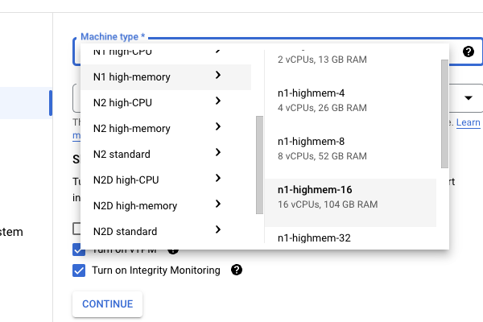
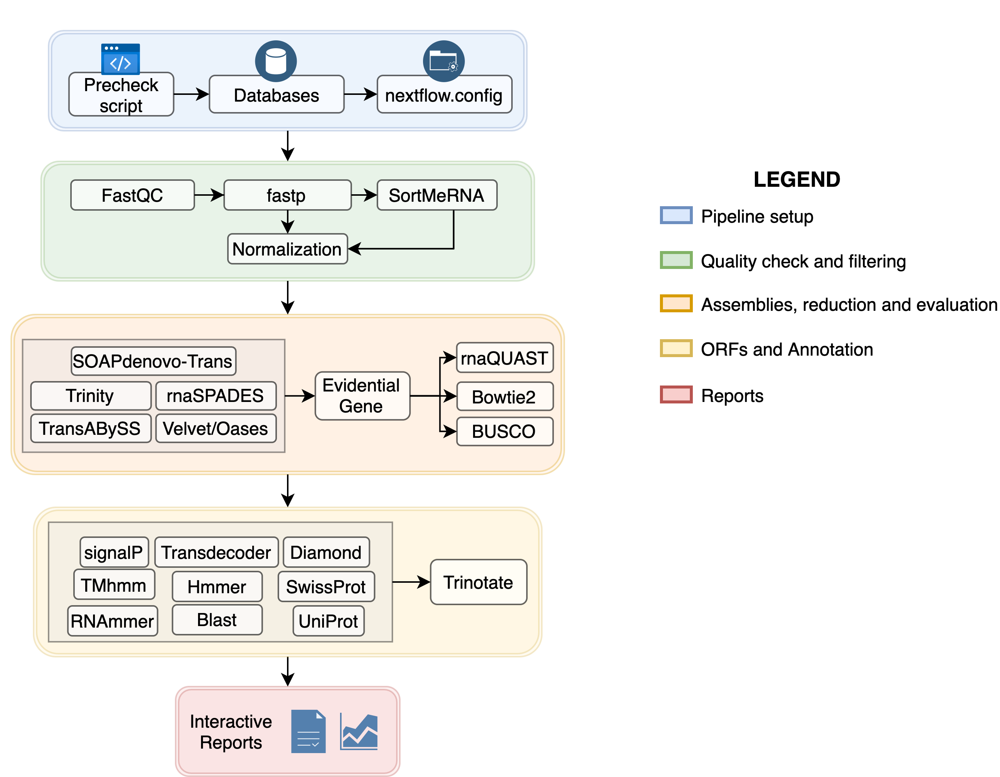

# MDI Biological Laboratory RNA-seq Transcriptome Assembly Module
---------------------------------


## Three primary and interlinked learning goals:
1. From a *biological perspective*, demonstration of the **process of transcriptome assembly** from raw RNA-seq data.
2. From a *computational perspective*, demonstration of **computing using workflow management and container systems**.
3. Also from a *computational perspective*, demonstration of **carrying out these analyses efficiently in a cloud environment.**


# Quick Overview
This module teaches you how to perform a short-read RNA-seq Transcriptome Assembly with Google Cloud Platform using a Nextflow pipeline, and eventually using the Google Cloud Life Sciences API. In addition to the overview given in this README, you will find three Jupyter notebooks that teach you different components of RNA-seq in the cloud. 

This module will cost you about $7.00 to run end to end, assuming you shutdown and delete all resources upon completion.


## Contents

+ [Getting Started](#GS)
+ [Biological Problem](#BP)
+ [Set Up](#SU)
+ [Software Requirements](#SOF)
+ [Workflow Diagrams](#WORK)
+ [Data](#DATA)
+ [Troubleshooting](#TR)
+ [Funding](#FUND)

## **Getting Started** <a name="GS"></a>
This learning module includes tutorials and execution scripts in the form of Jupyter notebooks. The purpose of these tutorials is to help users familiarize themselves with cloud computing in the specific context of running bioinformatics workflows to prep for and to carry out a transcriptome assembly, refinement, and annotation. These tutorials do this by utilizing a recently published Nextflow workflow (TransPi [manuscript](https://onlinelibrary.wiley.com/doi/10.1111/1755-0998.13593), [repository](https://github.com/palmuc/TransPi), and [user guide](https://palmuc.github.io/TransPi/)), which manages and passes data between several state-of-the-art programs, carrying out the processes from initial quality control and normalization, through assembly with several tools, refinement and assessment, and finally annotation of the final putative transcriptome.

Since the work is managed by this pipeline, the notebooks will focus on setting up and running the pipeline, followed by an examination of some of the wide range of outputs produced. We will also demonstrate how to retrieve the complete results directory so that users can examine more extensively on their own computing systems going step-by-step through specific workflows. These workflows cover the start to finish of basic bioinformatics analysis; starting from raw sequence data and carrying out the steps needed to generate a final assembled and annotated transcriptome.

We also put an emphasis on understanding how workflows execute, using the specific example of the Nextflow (https://www.nextflow.io) workflow engine, and on using workflow engines as supported by cloud infrastructure, using the specific example of the Google Cloud Life Sciences API (https://cloud.google.com/life-sciences).

> [](./images/tech_infra_diag.png)
> 
> **Figure 1:** The technical infrastructure diagram for this project.

## **Biological Problem** <a name="BP"></a>
The combination of increased availability and reduced expense in obtaining high-throughput sequencing has made transcriptome profiling analysis (primarily with RNA-seq) a standard tool for the molecular characterization of widely disparate biological systems. Researchers working in common model organisms, such as mouse or zebrafish, have relatively easy access to the necessary resources (e.g., well-assembled genomes and large collections of predicted/verified transcripts), for the analysis and interpretation of their data. In contrast, researchers working on less commonly studied organisms and systems often must develop these resources for themselves.

Transcriptome assembly is the broad term used to describe the process of estimating many (or ideally all) of an organism’s transcriptome based on the large-scale but fragmentary data provided by high-throughput sequencing. A "typical" RNA-seq dataset will consist of tens of millions of reads or read-pairs, with each contiguous read representing up to 150 nucleotides in the sequence. Complete transcripts, in contrast, typically range from hundreds to tens of thousands of nucleotides in length. In short, and leaving out the technical details, the process of assembling a transcriptome from raw reads (Figure 2) is to first make a "best guess" segregation of the reads into subsets that are most likely derived from one (or a small set of related/similar genes), and then for each subset, build a most-likely set of transcripts and genes.

> [](./images/basic_assembly.png)
>
> **Figure 2:** The process from raw reads to first transcriptome assembly.

Once a new transcriptome is generated, assessed, and refined, it must be annotated with putative functional assignments to be of use in subsequent functional studies.  Functional annotation is accomplished through a combination of assignment of homology-based and ab initio methods. The most well-established homology-based processes are the combination of protein-coding sequence prediction followed by protein sequence alignment to databases of known proteins, especially those from human or common model organisms. Ab initio methods use computational models of various features (e.g., known protein domains, signal peptides, or peptide modification sites) to characterize either the transcript or its predicted protein product. This training module will cover multiple approaches to the annotation of assembled transcriptomes.

## **Set Up** <a name="SU"></a>

#### Part 1: Setting up Environment

To begin work on this module, you will need to set up your Google Cloud Platform (GCP), Vertex AI, and Jupyter notebook instance. Please begin by navigating to the [NIH Cloud Lab README](https://github.com/STRIDES/NIHCloudLabGCP). This will walk you through the basics of cloud platforms and provide links for setting up the environment. Once you have set up your Google Cloud account, please refer to images below to set up a Jupyter notebook instance under Vertex AI. Follow the steps and clone this repository using the Git command `git clone https://github.com/NIGMS/rnaAssemblyMDI` from a terminal window. Please make sure you only enter the link for the repository that you want to clone. There are other bioinformatics related learning modules available in the [NIGMS Repository](https://github.com/NIGMS). Following is an example of this current repository when cloned in Jupyter notebook using Git.

#### Optional: *Creating a Nextflow Service Account*
If you are using Nextflow outside of NIH CloudLab you must set up a service account and add your service account to your notebook permissions before creating the notebook. Follow section 2 of the accompanying [How To document](https://github.com/NIGMS/NIGMS-Sandbox/blob/main/docs/HowToCreateNextflowServiceAccount.md) for instructions. If you are executing this tutorial with an NIH CloudLab account your default Compute Engine service account will have all required IAM roles to run the nextflow portion.

#### Part 2: Creating/Configuring Vertex AI Instance
1. Click the navigation menu  button in the top-left and go to `Vertex AI` and then `Workbench`. 
> 
2. Click the  button at the top followed by the `Python 3` option.
3. From there, you can name your notebook and change the region to a region near you. Then, at the bottom of the pop-up window, click the  button. This will allow for more fine-tuned adjustments to the notebook.
4. `Details` and `Environment` have already been specified, so just click the  button until the `Machine type` window. Under `Machine type`, go to `N1 high-memory` and then click `n1-highmem-16`. This will provide you with 16 vCPUs and 104 GB of RAM which may feel like a lot but is necessary for TransPi to run.
> 
5. Everything is now configured and you can click the  button to boot up your notebook for the first time.

#### Part 3: Adding the Modules to the Notebook
1. It may take a few minutes to fully provision your new notebook but once the circle next to your notebook changes from  to  it is ready to be opened.
2. Click the  button next to your notebook and wait for it to load up in a new tab.
3. Once it has finished loading, click the Terminal option in the Launcher.
> 
4. Next, paste the following git command to get a copy of everything within this repository, including all of the submodules.
>```git clone https://github.com/NIGMS/rnaAssemblyMDI>```
5. You are now all set!

**WARNING:** When you are not using the notebook, stop it. This will prevent you from incurring costs while you are not using the notebook. You can do this in the same window as where you opened the notebook. Make sure that you have the notebook selected . Then click the . When you want to start up the notebook again, do the same process except click the  instead.

## **Software Requirements** <a name="SOF"></a>

All of the software requirements are taken care of and installed within [Submodule_01_prog_setup.ipynb](./Submodule_01_prog_setup.ipynb). The key pieces of software needed are:
1. [Nextflow workflow system](https://www.nextflow.io/): Nextflow is a workflow management software that TransPi is built for.
2. [Google Life Sciences API](): GLS was enabled as part of the setup process and will be readily available when it is needed.
3. [Nextflow TransPi Package](https://github.com/palmuc/TransPi): The rest of the software is all downloaded as part of the TransPi package. TransPi is a Nextflow pipeline that carries out many of the standard steps required for transcriptome assembly and annotation. The original TransPi is available from this GitHub [link](https://github.com/palmuc/TransPi). We have made various alterations to the TransPi package and so the TransPi files you will be using throughout this module will be our own altered version.

## **Workflow Diagrams** <a name="WORK"></a>

> 
> 
> **Figure 3:** Nextflow workflow diagram. (Rivera 2021)
>> Image Source: https://github.com/PalMuc/TransPi/blob/master/README.md

Explanation of which notebooks execute which processes:

+ Notebooks labeled 0 ([Submodule_00_Background.ipynb](./Submodule_00_Background.ipynb) and [00_Glossary.md](./00_Glossary.md)) respectively cover background materials and provide a centralized glossary for both the biological problem of transcriptome assembly, as well as an introduction to workflows and container-based computing.
+ Notebook 1 ([Submodule_01_prog_setup.ipynb](./Submodule_01_prog_setup.ipynb)) is used for setting up the environment. It should only need to be run once per machine. (Note that our version of TransPi does not run the `precheck script`. To avoid the headache and wasted time, we have developed a workaround to skip that step.)
+ Notebook 2 ([Submodule_02_basic_assembly.ipynb](./Submodule_02_basic_assembly.ipynb)) carries out a complete run of the Nextflow TransPi assembly workflow on a modest sequence set, producing a small transcriptome.
+ Notebook 3 ([Submodule_03_annotation_only.ipynb](./Submodule_03_annotation_only.ipynb)) carries out an annotation-only run using a prebuilt, but more complete transcriptome.
+ Notebook 4 ([Submodule_04_gls_assembly.ipynb](./Submodule_04_gls_assembly.ipynb)) carries out the workflow using the Google Cloud Life Sciences API.

## **Data** <a name="DATA"></a>
The test dataset used in the majority of this module is a downsampled version of a dataset that can be obtained in its complete form from the SRA database (Bioproject [**PRJNA318296**](https://www.ncbi.nlm.nih.gov/bioproject/PRJNA318296), GEO Accession [**GSE80221**](https://www.ncbi.nlm.nih.gov/geo/query/acc.cgi?acc=GSE80221)). The data was originally generated by **Hartig et al., 2016**. We downsampled the data files in order to streamline the performance of the tutorials and stored them in a Google Cloud Storage bucket. The sub-sampled data, in individual sample files as well as a concatenated version of these files are available in our Google Cloud Storage bucket at `gs://mdibl-transpi-bucket/resources/seq2`.

Additional datasets for demonstration of the annotation features of TransPi were obtained from the NCBI Transcriptome Shotgun Assembly archive. These files can be found in our Google Cloud Storage bucket at `gs://mdibl-transpi-bucket/resources/trans`.
- Microcaecilia dermatophaga 
    - Bioproject: [**PRJNA387587**](https://www.ncbi.nlm.nih.gov/bioproject/PRJNA387587)
    - Originally generated by **Torres-Sánchez M et al., 2019**. 
- Oncorhynchus mykiss
    - Bioproject: [**PRJNA389609**](https://www.ncbi.nlm.nih.gov/bioproject/PRJNA389609)
    - Originally generated by **Wang J et al., 2016**, **Al-Tobasei R et al., 2016**, and **Salem M et al., 2015**. 
- Pseudacris regilla
    - Bioproject: [**PRJNA163143**](https://www.ncbi.nlm.nih.gov/bioproject/PRJNA163143)
    - Originally generated by **Laura Robertson, USGS**. 

## **Troubleshooting** <a name="TR"></a>
- If a quiz is not rendering:
    - Make sure the `pip install` cell was executed in Submodule 00.
    - Try re-executing `from jupytercards import display_flashcards` or `from jupyterquiz import display_quiz` depending on the quiz type. 
- If a file/directory is not able to be found, make sure that you are in the right directory. If the notebook is idle for a long time, gets reloaded, or restarted, you will need to re-run Step 1 of the notebook. (`%cd /home/jupyter`)
- Sometimes, Nextflow will print `WARN:` followed by the warning. These are okay and should not produce any errors.
- Sometimes Nextflow will print `Waiting for file transfers to complete`. This may take a few minutes, but is nothing to worry about.
- If you are unable to create a bucket using the `gsutil mb` command, check your `nextflow-service-account` roles. Make sure that you have `Storage Admin` added.
- If you are trying to execute a terminal command in a Jupyter code cell and it is not working, make sure that you have an `!` before the command.
    - e.g., `mkdir example-1` &rarr; `!mkdir example-1`

## **Funding** <a name="FUND"></a>

MDIBL Computational Biology Core efforts are supported by two Institutional Development Awards (IDeA) from the National Institute of General Medical Sciences of the National Institutes of Health under grant numbers P20GM103423 and P20GM104318.

## **License for Data** <a name="LIC"></a>

Text and materials are licensed under a Creative Commons CC-BY-NC-SA license. The license allows you to copy, remix and redistribute any of our publicly available materials, under the condition that you attribute the work (details in the license) and do not make profits from it. More information is available [here](https://tilburgsciencehub.com/about/#license).

<a rel="license" href="http://creativecommons.org/licenses/by-nc-sa/4.0/"></a><br />

This work is licensed under a <a rel="license" href="http://creativecommons.org/licenses/by-nc-sa/4.0/">Creative Commons Attribution-NonCommercial-ShareAlike 4.0 International License</a>.

The TransPi Nextflow workflow was developed and released by Ramon Rivera and can be obtained from its [GitHub repository](https://github.com/PalMuc/TransPi)
